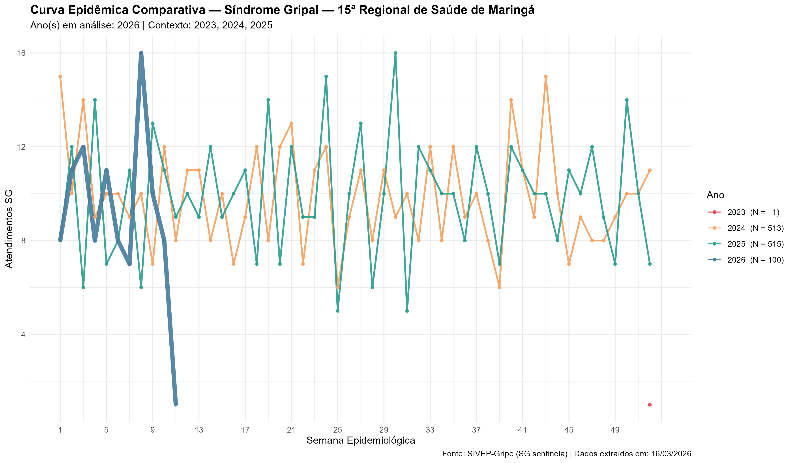
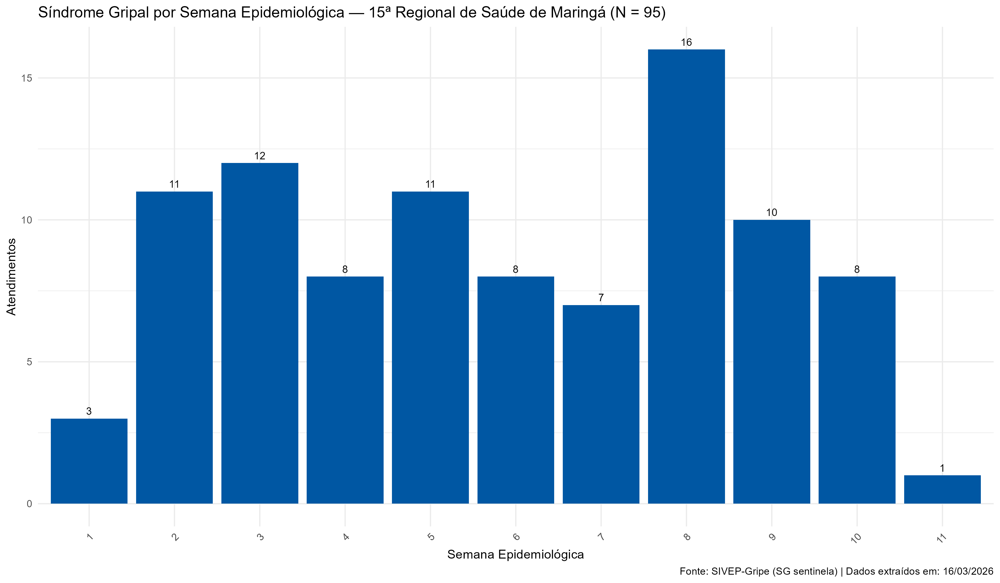
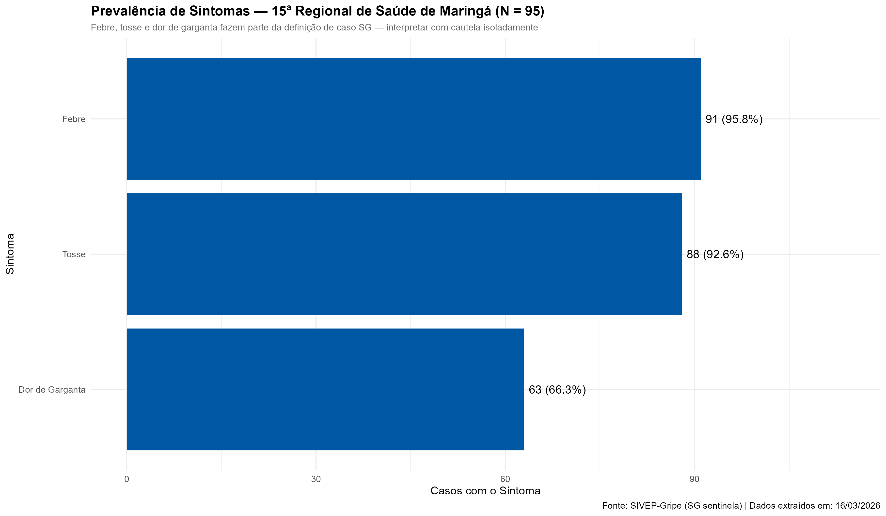
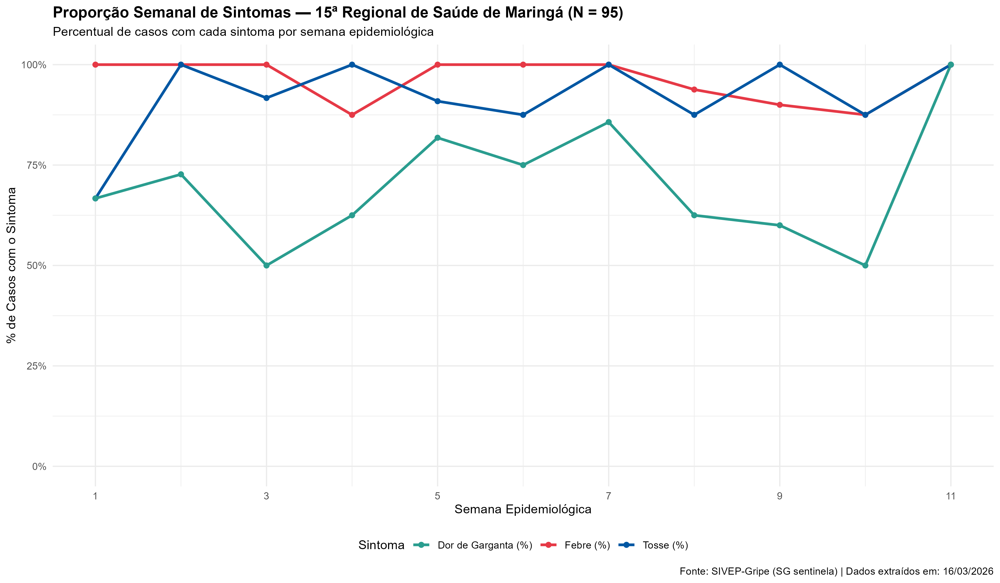
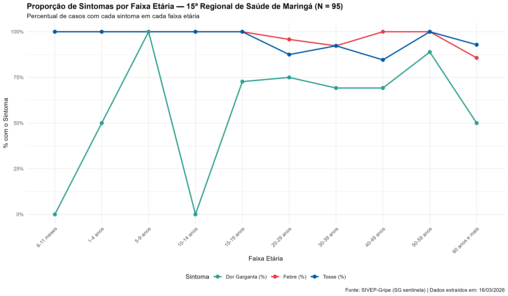
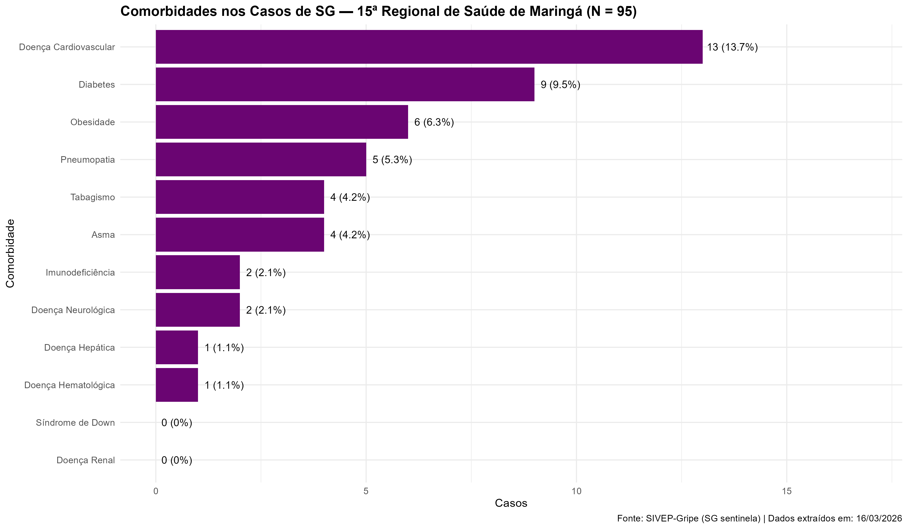
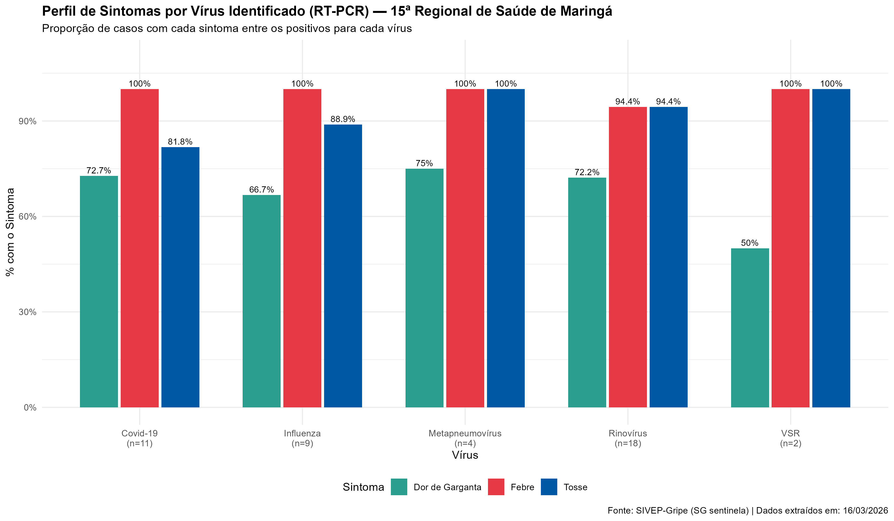

::: {.callout-tip}
**Ano de referência:** 2026 &nbsp;|&nbsp; **Fonte:** SIVEP-Gripe (módulo SG sentinela) &nbsp;|&nbsp; **Escopo:** unidades sentinela da 15ª RS
:::

Dados de Síndrome Gripal (SG) das unidades sentinela da 15ª Regional de Saúde. A Vigilância Sentinela monitora casos ambulatoriais — pacientes com febre de início súbito acompanhada de tosse ou dor de garganta — e representa a circulação viral na comunidade.

---

## Série temporal

::: {.panel-tabset}

### Curva comparativa

{.lightbox}

### Atendimentos semanais

{.lightbox}

:::

---

## Sintomas

::: {.panel-tabset}

### Prevalência geral

{.lightbox}

### Tendência semanal

{.lightbox}

### Por faixa etária

{.lightbox}

:::

---

## Comorbidades

{.lightbox}

---

## Circulação viral

{.lightbox}

---

*Dados sujeitos a revisão conforme encerramento de casos. Fonte: SIVEP-Gripe.*
